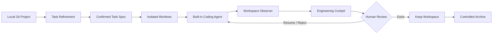

<div align="center">

**English** | [简体中文](README.zh-CN.md)

# 🎛️ AI Coding Cockpit

**A local-first, task-centric control plane for developers shipping production software with AI.**

Run multiple AI coding tasks in parallel—while always knowing what they are doing, what they changed, whether the checks passed, and when they need you.


</div>

---

AI agents are already good at writing code. The hard part is **staying in control when several tasks are running at once**.

Terminals and chat windows can tell you what an agent said, but they make it difficult to answer basic engineering questions:

- Which tasks are running right now?
- Which files and modules did each task actually change?
- Did the tests, lint, type checks, and build pass?
- Are two parallel tasks touching the same area of the codebase?
- Which task is blocked and waiting for my decision?
- If an agent is interrupted, can I recover the workspace and its evidence?

AI Coding Cockpit moves the control center from the **Agent Session** to the **Software Change**. Agents are execution resources; Tasks, Workspaces, Diffs, Checks, and Reviews are the durable engineering facts.

## ✨ Highlights

| Capability | What you get |
| --- | --- |
| **Multi-task cockpit** | Manage several parallel development tasks from one project view instead of juggling terminals and chats |
| **Task refinement** | Turn a rough idea into an editable, confirmable Task Spec using repository context |
| **Isolated execution** | Give every Task its own Git branch and worktree so parallel work does not contaminate other tasks |
| **Engineering observability** | Track files, diffs, modules, commands, checks, agent activity, and failures as they happen |
| **Overlap detection** | Surface deterministic file and module overlap between parallel tasks |
| **Human in the loop** | Clarify, cancel, resume, reject, review, and complete work without losing context |
| **Controlled archive** | Save a final snapshot and archive ref before releasing the task worktree |
| **Crash recovery** | Persist tasks, events, checks, reviews, and archive progress in SQLite |

> **The goal:** understand what is happening across an entire project within 10 seconds of opening the Cockpit.

## 🧭 How it works



Every task under a Project runs independently:

```text
Project
├── Task A → Agent Run → Worktree A
├── Task B → Agent Run → Worktree B
└── Task C → Agent Run → Worktree C
                         ↓
              Files · Diff · Checks · Risks
                         ↓
                    One Cockpit
```

Tasks move through a complete lifecycle:

```text
DRAFT → READY → RUNNING → NEEDS_YOU / REVIEW → DONE → ARCHIVED
                     ↘ FAILED ↗
```

## 🚀 Quick start

### Requirements

- Git 2.39+
- Python 3.11+
- [uv](https://docs.astral.sh/uv/) 0.8+
- Node.js 22+
- pnpm 9+

### 1. Install dependencies

```powershell
uv sync --dev
pnpm --dir frontend install
```

### 2. Start the services

Open two terminals at the repository root:

```powershell
# Terminal 1 · API
uv run uvicorn backend.app.main:app --reload --port 8000
```

```powershell
# Terminal 2 · Web
pnpm --dir frontend dev
```

Open **http://localhost:4173**, add a local Git repository, and create your first Task.

The default `demo` provider does not require an API key. It lets you try the complete Task, Worktree, Event, Review, and Archive workflow immediately.

### 3. Connect a real model (optional)

Copy the environment template and provide your model provider API key:

```powershell
Copy-Item backend/.env.example backend/.env
```

```dotenv
AGENT_COCKPIT_API_KEY=your-api-key
AGENT_COCKPIT_MAX_CONCURRENT_RUNS=3
```

After startup, use Settings to select the provider, model name, and an optional OpenAI-compatible base URL. API keys are read only from the environment or the operating system credential store. They are never written to SQLite, Task Specs, Events, or Agent Context files.

<details>
<summary><strong>Advanced configuration</strong></summary>

The backend reads `backend/.env` by default:

| Environment variable | Default | Purpose |
| --- | --- | --- |
| `AGENT_COCKPIT_API_KEY` | Empty | API key for non-Demo providers |
| `AGENT_COCKPIT_DATA_DIR` | `.agent-cockpit` | Root directory for SQLite and managed worktrees |
| `AGENT_COCKPIT_DATABASE_PATH` | `<data-dir>/agent-cockpit.db` | Custom database path |
| `AGENT_COCKPIT_MAX_CONCURRENT_RUNS` | `3` | Maximum number of active agent runs |
| `AGENT_COCKPIT_COMMAND_TIMEOUT_SECONDS` | `120` | Per-command timeout in seconds |
| `AGENT_COCKPIT_FRONTEND_ORIGIN` | `http://localhost:4173` | Frontend origin allowed to access the API |

Project paths support Windows backslashes, forward slashes, quoted paths, `~`, environment variables, and relative paths. On Windows, use `G:\Projects\my-app` or `G:/Projects/my-app`; the ambiguous form `G:Projects\my-app` is rejected.

</details>

## 🔍 What you see in the Cockpit

The home view prioritizes actionable engineering information instead of an endlessly scrolling terminal:

- **Active** — current action, run summary, recent files, affected modules, and elapsed time
- **Needs You** — clarification requests, failure reasons, and the recommended next action
- **Review** — Task Spec, full diff, checks, known issues, and potential risks
- **Risks** — file and module overlap across concurrent tasks
- **History** — read-only evidence and final snapshots for Done and Archived tasks

Task Detail adds Spec, Files, Diff, Modules, Timeline, Checks, and Agent Activity. Chat and raw terminal output remain available as debugging evidence, but they are not the center of the product.

## 🏗️ Architecture

```text
React + TypeScript + Vite
          │ REST / WebSocket
          ▼
FastAPI · Task Runtime · Workspace Observer
          │
          ├── SQLite ───────── Project / Task / Run / Event / Check / Review
          ├── Git Worktrees ── Isolated task workspaces
          └── AgentAdapter ─── Demo / OpenAI-compatible built-in agent
```

The architecture follows three rules:

1. **SQLite is the source of truth.** Markdown Context files are rebuildable projections for agents.
2. **Observed state beats agent self-reporting.** Files, diffs, and checks come from the workspace observer.
3. **Workspace lifecycle is controlled.** Agents cannot run branch, checkout, merge, push, reset, switch, or worktree lifecycle operations.

## 🛡️ Local-first and security boundaries

- Projects, the database, and managed task worktrees remain on your machine.
- Every tool call is restricted to the verified worktree assigned to its Task.
- Commands have an explicit working directory, timeout, cancellation path, and audit trail.
- Event and diff projections redact the current API key.
- Archive scans the managed workspace and stops safely if it finds the current API key.
- Archive uses a temporary Git index to create `refs/agent-cockpit/archives/<task-id>` before removing the corresponding worktree.

`DONE` keeps the full workspace available for further edits. `ARCHIVED` releases the workspace while preserving read-only history. You can also restart from an archived commit, creating a linked Task with a new branch and worktree.

<details>
<summary><strong>Backup and recovery</strong></summary>

Create an online SQLite backup with Python's standard backup API:

```powershell
uv run python -c "import sqlite3; s=sqlite3.connect('.agent-cockpit/agent-cockpit.db'); d=sqlite3.connect('agent-cockpit-backup.db'); s.backup(d); d.close(); s.close()"
```

Before restoring, stop the backend and preserve the current data directory as a rollback copy, then replace the database file. The SQLite backup does not contain worktrees or the original Git repositories; a complete disaster-recovery backup should also include `.agent-cockpit/worktrees/` and all registered repositories.

</details>

## 🧩 Project structure

```text
agent-cockpit/
├── backend/                 # FastAPI, SQLite, Task Runtime, Agent, Workspace services
│   ├── app/
│   └── tests/               # API, concurrency, recovery, archive, V1 acceptance tests
├── frontend/                # React, TypeScript, Vite
│   └── src/                 # Cockpit, Task Workspace, colocated tests
└── docs/
    ├── product/             # Product source of truth
    └── roadmap/             # I0–I9 plans, implementation notes, acceptance evidence
```

## ✅ Development and verification

```powershell
uv run ruff check backend
uv run pytest --cov=backend/app --cov-report=term-missing
pnpm --dir frontend lint
pnpm --dir frontend test
pnpm --dir frontend build
```

The V1 automated acceptance suite covers Project onboarding, Task Refinement, isolated workspaces, Agent Runtime, observability, concurrency limits, human intervention, Review, Overlap, Archive, secret scanning, and crash recovery. See the [V1 Release acceptance record](docs/roadmap/milestones/03-v1-release-acceptance.md) for the evidence.

## 🗺️ V1 scope and roadmap

V1 is focused on one hypothesis: **a Cockpit centered on Software Change Observability is more useful than several Agent terminals and chat windows running side by side.**

Current boundaries:

- Local, single-user, single-process runtime
- Merge is performed manually outside the Cockpit
- Overlap reports deterministic file or module intersections; it does not infer semantic conflicts
- No Multi-Agent Team, independent QA agent, external Agent Adapter, cloud collaboration, or distributed scheduling in V1

Future directions include independent verification, verification gates, external Agent Adapters, automatic module discovery, semantic impact analysis, scope-drift detection, remote execution, and distributed scheduling. These are roadmap items, not shipped V1 capabilities.

## 📚 Documentation

- [Product design document](docs/product/AI调度看板.md) — positioning, data model, interaction design, architecture principles, and long-term direction
- [V1 iteration plan](docs/roadmap/V1_ITERATION_PLAN.md) — I0–I9 scope and definition of done
- [Documentation index](docs/README.md) — milestones, implementation plans, and acceptance records

---

<div align="center">

**Stop managing agent windows. Start managing software changes.**

</div>
