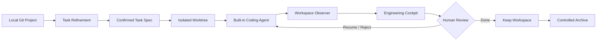

<div align="center">

[English](README.md) | **简体中文**

# 🎛️ AI Coding Cockpit

**一个 Local-first、Task-centric 的 AI 编程任务控制台。**

让多个 AI Coding Task 同时推进，也始终知道它们正在做什么、改了哪里、是否通过检查，以及何时需要你介入。


</div>

---

AI Agent 已经很会写代码了，真正困难的是：**当多个任务一起运行时，如何保持控制。**

终端和聊天窗口能告诉你 Agent “说了什么”，却很难快速回答这些工程问题：

- 现在有哪些任务正在运行？
- 每个任务实际修改了哪些文件和模块？
- 测试、Lint、类型检查和构建是否通过？
- 两个并行任务是否正在触碰同一片代码？
- 哪个任务卡住了，正在等待我的决定？
- Agent 中断后，工作现场和证据还能否恢复？

AI Coding Cockpit 把控制中心从 **Agent Session** 转向 **Software Change**。在这里，Agent 只是任务的执行资源；Task、Workspace、Diff、Checks 和 Review 才是持续存在的工程事实。

## ✨ 核心能力

| 能力 | 你能得到什么 |
| --- | --- |
| **多 Task 控制台** | 在一个项目视图中管理多个并行开发任务，不再来回切换终端和聊天窗口 |
| **需求整理** | 结合仓库上下文把模糊想法整理成可编辑、可确认的 Task Spec |
| **隔离执行** | 每个 Task 拥有独立 Git Branch 与 Worktree，避免任务之间互相污染 |
| **工程可观测性** | 持续记录文件、Diff、模块、命令、检查结果、Agent 活动和失败原因 |
| **风险提示** | 识别并行任务之间确定的文件重叠与模块重叠 |
| **人在回路中** | 支持澄清、取消、恢复、Reject、Resume、Review 与 Done 完整闭环 |
| **受控归档** | 保存最终 Snapshot 和 Archive Ref，验证成功后再释放 Worktree |
| **崩溃恢复** | SQLite 持久化事实；应用重启后仍可恢复任务、事件、检查和归档进度 |

> **目标体验：** 打开 Cockpit 后，在 10 秒内看懂整个项目正在发生什么。

## 🧭 它如何工作



同一 Project 下，每个任务独立运行：

```text
Project
├── Task A → Agent Run → Worktree A
├── Task B → Agent Run → Worktree B
└── Task C → Agent Run → Worktree C
                         ↓
              Files · Diff · Checks · Risks
                         ↓
                    One Cockpit
```

任务状态贯穿完整生命周期：

```text
DRAFT → READY → RUNNING → NEEDS_YOU / REVIEW → DONE → ARCHIVED
                     ↘ FAILED ↗
```

## 🚀 快速开始

### 环境要求

- Git 2.39+
- Python 3.11+
- [uv](https://docs.astral.sh/uv/) 0.8+
- Node.js 22+
- pnpm 9+

### 1. 安装依赖

```powershell
uv sync --dev
pnpm --dir frontend install
```

### 2. 启动服务

打开两个终端，在仓库根目录分别运行：

```powershell
# Terminal 1 · API
uv run uvicorn backend.app.main:app --reload --port 8000
```

```powershell
# Terminal 2 · Web
pnpm --dir frontend dev
```

访问 **http://localhost:4173**，添加一个本地 Git Repository，然后创建你的第一个 Task。

默认的 `demo` Provider 不需要 API Key，可以直接体验 Task、Worktree、事件、Review 与 Archive 全流程。

### 3. 接入真实模型（可选）

复制配置模板并填入 Provider API Key：

```powershell
Copy-Item backend/.env.example backend/.env
```

```dotenv
AGENT_COCKPIT_API_KEY=your-api-key
AGENT_COCKPIT_MAX_CONCURRENT_RUNS=3
```

启动后在 Settings 中选择模型 Provider、模型名称和可选的 OpenAI-compatible Base URL。API Key 仅从环境变量或系统凭据存储读取，不会写入 SQLite、Task Spec、Event 或 Agent Context。

<details>
<summary><strong>高级配置</strong></summary>

后端默认读取 `backend/.env`：

| 环境变量 | 默认值 | 用途 |
| --- | --- | --- |
| `AGENT_COCKPIT_API_KEY` | 空 | 非 Demo Provider 的 API Key |
| `AGENT_COCKPIT_DATA_DIR` | `.agent-cockpit` | SQLite 与受管 Worktree 根目录 |
| `AGENT_COCKPIT_DATABASE_PATH` | `<data-dir>/agent-cockpit.db` | 自定义数据库路径 |
| `AGENT_COCKPIT_MAX_CONCURRENT_RUNS` | `3` | 同时活动的 Agent Run 上限 |
| `AGENT_COCKPIT_COMMAND_TIMEOUT_SECONDS` | `120` | 单条命令超时秒数 |
| `AGENT_COCKPIT_FRONTEND_ORIGIN` | `http://localhost:4173` | 允许访问 API 的前端来源 |

Project 路径支持 Windows 反斜杠、正斜杠、引号包裹路径、`~`、环境变量和相对路径。Windows 下请使用 `G:\Projects\my-app` 或 `G:/Projects/my-app`；歧义形式 `G:Projects\my-app` 会被拒绝。

</details>

## 🔍 Cockpit 里能看到什么

Cockpit 首页优先展示真正需要注意的信息，而不是不断滚动的终端输出：

- **Active**：当前动作、运行摘要、最近修改、影响模块和耗时
- **Needs You**：等待澄清、失败原因和建议的下一步
- **Review**：Task Spec、完整 Diff、Checks、已知问题和潜在风险
- **Risks**：任务之间的 File Overlap 与 Module Overlap
- **History**：Done / Archived 任务的只读证据与最终 Snapshot

Task Detail 进一步提供 Spec、Files、Diff、Modules、Timeline、Checks 和 Agent Activity。聊天与原始终端保留为调试证据，但不占据产品中心。

## 🏗️ 架构

```text
React + TypeScript + Vite
          │ REST / WebSocket
          ▼
FastAPI · Task Runtime · Workspace Observer
          │
          ├── SQLite ───────── Project / Task / Run / Event / Check / Review
          ├── Git Worktrees ── Isolated task workspaces
          └── AgentAdapter ─── Demo / OpenAI-compatible built-in agent
```

设计坚持三个原则：

1. **SQLite 是唯一事实来源**：Markdown Context 只是可重建的 Agent 投影。
2. **实际状态优先于 Agent 自述**：Files、Diff 和 Checks 来自 Workspace 观测。
3. **Workspace 生命周期受控**：Agent 不能自行执行 branch、checkout、merge、push、reset、switch 或 worktree 操作。

## 🛡️ Local-first 与安全边界

- 项目、数据库和任务 Worktree 全部保留在本机。
- 每个工具调用都被限制在分配给 Task 的已验证 Worktree 内。
- 命令具有明确的工作目录、超时、取消与审计记录。
- 事件和 Diff 投影会对当前 API Key 脱敏。
- Archive 前会扫描受管 Workspace；发现当前 API Key 时停止归档并保留现场。
- Archive 使用临时 Git index 创建 `refs/agent-cockpit/archives/<task-id>`，验证成功后才移除对应 Worktree。

`DONE` 会保留完整工作现场，方便继续修改；`ARCHIVED` 会释放 Workspace，但保留只读历史。你也可以从归档提交“重新开始”，创建一个关联的新 Task、Branch 和 Worktree。

<details>
<summary><strong>备份与恢复</strong></summary>

SQLite 在线备份可以使用 Python 标准库的 backup API：

```powershell
uv run python -c "import sqlite3; s=sqlite3.connect('.agent-cockpit/agent-cockpit.db'); d=sqlite3.connect('agent-cockpit-backup.db'); s.backup(d); d.close(); s.close()"
```

恢复前先停止后端并保留现有数据目录作为回滚副本，再替换数据库文件。SQLite 备份不包含 Worktree 和原始 Git Repository；完整灾备还需备份 `.agent-cockpit/worktrees/` 与已注册仓库。

</details>

## 🧩 项目结构

```text
agent-cockpit/
├── backend/                 # FastAPI、SQLite、Task Runtime、Agent 与 Workspace 服务
│   ├── app/
│   └── tests/               # API、并发、恢复、归档与 V1 验收测试
├── frontend/                # React、TypeScript、Vite
│   └── src/                 # Cockpit、Task Workspace 与 colocated tests
└── docs/
    ├── product/             # 产品设计事实来源
    └── roadmap/             # I0–I9 计划、实施方案与验收记录
```

## ✅ 开发与验证

```powershell
uv run ruff check backend
uv run pytest --cov=backend/app --cov-report=term-missing
pnpm --dir frontend lint
pnpm --dir frontend test
pnpm --dir frontend build
```

当前 V1 自动化验收覆盖 Project 接入、Task Refinement、隔离 Workspace、Agent Runtime、可观测性、并发容量、人工介入、Review、Overlap、Archive、密钥扫描与崩溃恢复。详细证据见 [V1 Release 验收记录](docs/roadmap/milestones/03-v1-release-acceptance.md)。

## 🗺️ V1 边界与后续方向

V1 聚焦于验证 **“以 Software Change Observability 为中心的 Cockpit，是否优于同时打开多个 Agent Terminal / Chat”**。

当前边界：

- 本地单用户、单进程 Runtime
- Merge 由用户在系统外完成
- Overlap 只表示确定的文件或模块交集，不推断语义冲突
- 不包含 Multi-Agent Team、独立 QA Agent、外部 Agent Adapter、云协作或分布式调度

后续规划包括独立验证、Verification Gate、外部 Agent Adapter、自动模块发现、语义影响分析、Scope Drift 检测、远程执行与分布式调度。它们是产品方向，尚不属于 V1 已交付能力。

## 📚 文档

- [产品设计文档](docs/product/AI调度看板.md)：定位、模型、交互、架构原则与长期方向
- [V1 迭代计划](docs/roadmap/V1_ITERATION_PLAN.md)：I0–I9 的范围与完成定义
- [文档中心](docs/README.md)：里程碑、实施方案与验收记录索引

---

<div align="center">

**Stop managing agent windows. Start managing software changes.**

</div>
